# XianTao 数据库表设计

## 1. 用户系统

### xt_user - 游戏角色核心表

| 字段名                      | 类型          | 约束              | 默认值               | 说明                         |
|--------------------------|-------------|-----------------|-------------------|----------------------------|
| id                       | BIGSERIAL   | PRIMARY KEY     | -                 | 内部唯一角色ID                   |
| nickname                 | VARCHAR(64) | NOT NULL UNIQUE | -                 | 玩家道号/昵称（唯一）                |
| level                    | INT         | NOT NULL        | 1                 | 角色等级                       |
| exp                      | BIGINT      | NOT NULL        | 0                 | 当前经验值                      |
| coins                    | BIGINT      | NOT NULL        | 0                 | 基础货币（铜币）                   |
| spirit_stones            | BIGINT      | NOT NULL        | 0                 | 高级货币（灵石）                   |
| stat_str                 | INT         | NOT NULL        | 5                 | 力量属性（影响破坏力/锻造）             |
| stat_con                 | INT         | NOT NULL        | 5                 | 体质属性（影响生命值/物理防御）           |
| stat_agi                 | INT         | NOT NULL        | 5                 | 敏捷属性（影响出手顺序/杀怪效率）          |
| stat_wis                 | INT         | NOT NULL        | 5                 | 智慧属性（影响经验加成/炼药）            |
| free_stat_points         | INT         | NOT NULL        | 0                 | 剩余可分配属性点                   |
| hp_current               | INT         | NOT NULL        | 200               | 当前生命值                      |
| stamina_current          | INT         | NOT NULL        | 100               | 当前体力值                      |
| status                   | VARCHAR(32) | NOT NULL        | 'idle'            | 当前状态                       |
| location_id              | BIGINT      | NOT NULL        | 0                 | 当前所在地图ID                   |
| training_start_time      | TIMESTAMP   | -               | -                 | 历练开始时间戳（用于结算收益）            |
| breakthrough_fail_count  | INT         | NOT NULL        | 0                 | 突破失败次数（影响下一次突破成功率）         |
| last_reset_points_time   | TIMESTAMP   | -               | -                 | 上次洗点时间戳（用于洗点冷却判定，3天冷却）     |
| last_stamina_update_time | TIMESTAMP   | -               | -                 | 上次体力更新时间戳（用于离线恢复计算）        |
| travel_start_time        | TIMESTAMP   | -               | -                 | 旅行开始时间戳（用于计算旅行进度）          |
| travel_destination_id    | BIGINT      | -               | -                 | 旅行目的地地图ID                  |
| extra_data               | JSONB       | -               | '{}'              | JSONB扩展字段（存储称号、成就、小规模系统数据） |
| create_time              | TIMESTAMP   | NOT NULL        | CURRENT_TIMESTAMP | 角色创建时间                     |
| update_time              | TIMESTAMP   | NOT NULL        | CURRENT_TIMESTAMP | 最后一次数据更新时间                 |

**索引**: `idx_xt_user_level` (level DESC), `idx_xt_user_coins` (coins DESC), `idx_xt_user_spirit_stones` (spirit_stones
DESC)

### xt_user_auth - 跨平台授权绑定表

| 字段名              | 类型           | 约束                    | 默认值               | 说明         |
|------------------|--------------|-----------------------|-------------------|------------|
| id               | BIGSERIAL    | PRIMARY KEY           | -                 | 绑定记录主键     |
| user_id          | BIGINT       | NOT NULL, FOREIGN KEY | -                 | 关联的游戏角色ID  |
| platform         | VARCHAR(32)  | NOT NULL              | -                 | 平台类型       |
| platform_open_id | VARCHAR(128) | NOT NULL              | -                 | 平台方的唯一标识ID |
| bind_time        | TIMESTAMP    | NOT NULL              | CURRENT_TIMESTAMP | 绑定发生的时间    |

**约束**: `uq_platform_id` UNIQUE (platform, platform_open_id)  
**索引**: `idx_xt_user_auth_user_id` (user_id)

## 2. 物品系统

### xt_item_template - 物品模板配置表

| 字段名             | 类型           | 约束          | 默认值                                 | 说明                     |
|-----------------|--------------|-------------|-------------------------------------|------------------------|
| id              | BIGSERIAL    | PRIMARY KEY | -                                   | 模板ID                   |
| name            | VARCHAR(128) | NOT NULL    | -                                   | 物品名称                   |
| type            | VARCHAR(32)  | NOT NULL    | -                                   | 物品类型                   |
| rarity          | VARCHAR(32)  | NOT NULL    | 'common'                            | 稀有度                    |
| slot            | VARCHAR(32)  | -           | -                                   | 装备部位（仅装备类）             |
| equip_level     | INT          | NOT NULL    | 0                                   | 装备等级（仅装备类，用于计算词条数值）    |
| base_stat_bonus | JSONB        | -           | '{"str":0,"con":0,"agi":0,"wis":0}' | 基础属性加成                 |
| base_attack     | INT          | NOT NULL    | 0                                   | 基础攻击力                  |
| base_defense    | INT          | NOT NULL    | 0                                   | 基础防御力                  |
| drop_weight     | JSONB        | -           | '{}'                                | 掉落权重JSONB（仅装备类）        |
| tags            | JSONB        | -           | '[]'                                | 物品标签JSONB，用于AI检索和NPC交互 |
| grow_time       | INT          | -           | -                                   | 生长时间（小时，仅种子/灵蛋）        |
| yield_id        | VARCHAR(64)  | -           | -                                   | 成熟后产出的物品模板ID（仅种子/灵蛋）   |
| survive_rate    | INT          | -           | -                                   | 存活率百分比（仅种子/灵蛋）         |
| max_stack       | INT          | NOT NULL    | 1                                   | 最大堆叠数量                 |
| description     | TEXT         | -           | -                                   | 物品描述                   |
| create_time     | TIMESTAMP    | NOT NULL    | CURRENT_TIMESTAMP                   | 创建时间                   |
| update_time     | TIMESTAMP    | NOT NULL    | CURRENT_TIMESTAMP                   | 更新时间                   |

**索引**: `idx_item_template_tags` (tags GIN)

### xt_equipment - 装备实例表

| 字段名                | 类型               | 约束                    | 默认值                                 | 说明                |
|--------------------|------------------|-----------------------|-------------------------------------|-------------------|
| id                 | BIGSERIAL        | PRIMARY KEY           | -                                   | 装备唯一ID            |
| user_id            | BIGINT           | NOT NULL, FOREIGN KEY | -                                   | 持有者用户ID           |
| template_id        | BIGINT           | NOT NULL, FOREIGN KEY | -                                   | 物品模板ID            |
| name               | VARCHAR(128)     | NOT NULL              | -                                   | 装备名称              |
| slot               | VARCHAR(32)      | NOT NULL              | -                                   | 装备部位              |
| rarity             | VARCHAR(32)      | NOT NULL              | 'common'                            | 稀有度               |
| stat_bonus         | JSONB            | -                     | '{"str":0,"con":0,"agi":0,"wis":0}' | 属性加成JSONB         |
| attack_bonus       | INT              | NOT NULL              | 0                                   | 攻击力加成             |
| defense_bonus      | INT              | NOT NULL              | 0                                   | 防御力加成             |
| equipped           | BOOLEAN          | NOT NULL              | FALSE                               | 是否已穿戴             |
| quality_multiplier | DOUBLE PRECISION | -                     | -                                   | 品质系数（实际波动值，如1.35） |
| affixes            | JSONB            | -                     | '{}'                                | 随机词条JSONB         |
| forge_level        | INT              | -                     | 0                                   | 锻造强化等级            |
| create_time        | TIMESTAMP        | NOT NULL              | CURRENT_TIMESTAMP                   | 创建时间              |
| update_time        | TIMESTAMP        | NOT NULL              | CURRENT_TIMESTAMP                   | 更新时间              |

**索引**: `idx_xt_equipment_user_id` (user_id), `idx_xt_equipment_user_equipped` (user_id, equipped),
`idx_xt_equipment_user_slot` (user_id, slot), `idx_xt_equipment_stat_bonus` (stat_bonus GIN), `idx_equipment_affixes` (
affixes GIN)

### xt_inventory_item - 物品实例表（堆叠类物品）

| 字段名          | 类型           | 约束                    | 默认值               | 说明                                           |
|--------------|--------------|-----------------------|-------------------|----------------------------------------------|
| id           | BIGSERIAL    | PRIMARY KEY           | -                 | 物品实例ID                                       |
| user_id      | BIGINT       | NOT NULL, FOREIGN KEY | -                 | 持有者用户ID                                      |
| template_id  | BIGINT       | NOT NULL, FOREIGN KEY | -                 | 物品模板ID                                       |
| item_type    | VARCHAR(32)  | NOT NULL              | -                 | 物品类型（MATERIAL, SEED, SPIRIT_EGG, CONSUMABLE） |
| name         | VARCHAR(128) | NOT NULL              | -                 | 物品名称（从模板复制）                                  |
| quantity     | INT          | NOT NULL              | 1                 | 数量                                           |
| tags         | JSONB        | -                     | '[]'              | 物品标签JSONB，用于AI检索和NPC交互                       |
| grow_time    | INT          | -                     | -                 | 生长时间（小时，仅种子/灵蛋）                              |
| yield_id     | VARCHAR(64)  | -                     | -                 | 成熟后产出的物品模板ID（仅种子/灵蛋）                         |
| survive_rate | INT          | -                     | -                 | 存活率百分比（仅种子/灵蛋）                               |
| create_time  | TIMESTAMP    | NOT NULL              | CURRENT_TIMESTAMP | 创建时间                                         |
| update_time  | TIMESTAMP    | NOT NULL              | CURRENT_TIMESTAMP | 更新时间                                         |

**约束**: `uk_user_template` UNIQUE (user_id, template_id)  
**索引**: `idx_inventory_item_user_id` (user_id), `idx_inventory_item_user_type` (user_id, item_type),
`idx_inventory_item_tags` (tags GIN)

## 3. 地图系统

### xt_map_node - 地图节点表

| 字段名                 | 类型           | 约束              | 默认值               | 说明                                          |
|---------------------|--------------|-----------------|-------------------|---------------------------------------------|
| id                  | BIGSERIAL    | PRIMARY KEY     | -                 | 地图节点ID                                      |
| name                | VARCHAR(128) | NOT NULL UNIQUE | -                 | 地图名称                                        |
| description         | TEXT         | -               | -                 | 地图描述                                        |
| map_type            | VARCHAR(32)  | NOT NULL        | -                 | 地图类型（safe_town, training_zone, hidden_zone） |
| level_requirement   | INT          | NOT NULL        | 1                 | 推荐等级                                        |
| travel_time_minutes | INT          | NOT NULL        | 5                 | 旅行耗时（分钟）                                    |
| neighbors           | JSONB        | -               | '{}'              | 相邻地图及耗时JSONB                                |
| specialties         | JSONB        | -               | '[]'              | 历练掉落池JSONB                                  |
| travel_events       | JSONB        | -               | '[]'              | 旅行事件权重JSONB                                 |
| create_time         | TIMESTAMP    | NOT NULL        | CURRENT_TIMESTAMP | 创建时间                                        |
| update_time         | TIMESTAMP    | NOT NULL        | CURRENT_TIMESTAMP | 更新时间                                        |

**索引**: `idx_map_node_type` (map_type), `idx_map_node_level` (level_requirement), `idx_map_node_neighbors` (neighbors
GIN), `idx_map_node_specialties` (specialties GIN), `idx_map_node_travel_events` (travel_events GIN)

### xt_map_connection - 地图连接表

| 字段名                 | 类型        | 约束                    | 默认值               | 说明       |
|---------------------|-----------|-----------------------|-------------------|----------|
| id                  | BIGSERIAL | PRIMARY KEY           | -                 | 连接ID     |
| from_map_id         | BIGINT    | NOT NULL, FOREIGN KEY | -                 | 起始地图ID   |
| to_map_id           | BIGINT    | NOT NULL, FOREIGN KEY | -                 | 目标地图ID   |
| travel_time_minutes | INT       | NOT NULL              | 5                 | 旅行耗时（分钟） |
| bidirectional       | BOOLEAN   | NOT NULL              | true              | 是否双向连接   |
| create_time         | TIMESTAMP | NOT NULL              | CURRENT_TIMESTAMP | 创建时间     |
| update_time         | TIMESTAMP | NOT NULL              | CURRENT_TIMESTAMP | 更新时间     |

**索引**: `idx_map_connection_from` (from_map_id), `idx_map_connection_to` (to_map_id), `idx_map_connection_from_to` (
from_map_id, to_map_id)

## 4. 护道系统

### xt_dao_protection - 护道关系表

| 字段名          | 类型        | 约束                    | 默认值               | 说明             |
|--------------|-----------|-----------------------|-------------------|----------------|
| id           | BIGSERIAL | PRIMARY KEY           | -                 | 护道关系ID         |
| protector_id | BIGINT    | NOT NULL, FOREIGN KEY | -                 | 护道者ID（提供加成的一方） |
| protege_id   | BIGINT    | NOT NULL, FOREIGN KEY | -                 | 被护道者ID（突破的一方）  |
| create_time  | TIMESTAMP | NOT NULL              | CURRENT_TIMESTAMP | 建立护道关系的时间      |
| update_time  | TIMESTAMP | NOT NULL              | CURRENT_TIMESTAMP | 更新时间           |

**约束**: `uq_protection` UNIQUE (protector_id, protege_id)  
**索引**: `idx_dao_protection_protector` (protector_id), `idx_dao_protection_protege` (protege_id)

## 5. 福地系统

### xt_fudi - 福地系统核心表

| 字段名                    | 类型          | 约束                           | 默认值                                              | 说明                           |
|------------------------|-------------|------------------------------|--------------------------------------------------|------------------------------|
| id                     | BIGSERIAL   | PRIMARY KEY                  | -                                                | 福地唯一ID                       |
| user_id                | BIGINT      | NOT NULL UNIQUE, FOREIGN KEY | -                                                | 所属玩家ID                       |
| aura_current           | INTEGER     | NOT NULL, CHECK >= 0         | 0                                                | 当前灵气值                        |
| aura_max               | INTEGER     | NOT NULL, CHECK > 0          | 1000                                             | 灵气上限（由聚灵核心等级决定）              |
| core_level             | INTEGER     | NOT NULL, CHECK >= 1         | 1                                                | 聚灵核心等级                       |
| grid_size              | INTEGER     | NOT NULL, CHECK IN (3,4,5)   | 3                                                | 福地网格大小（3/4/5）                |
| spirit_level           | INTEGER     | NOT NULL                     | 1                                                | 地灵等级                         |
| mbti_type              | VARCHAR(4)  | NOT NULL                     | -                                                | 地灵MBTI人格类型（锁定，不可更改）          |
| spirit_stage           | INTEGER     | NOT NULL                     | 1                                                | 地灵形态阶段（1=初创之灵/2=底蕴之灵/3=化形之灵） |
| spirit_energy          | INTEGER     | NOT NULL, CHECK 0-100        | 100                                              | 地灵精力值（0-100，每天恢复100点）        |
| spirit_affection       | INTEGER     | NOT NULL                     | 0                                                | 地灵好感度                        |
| emotion_state          | VARCHAR(20) | NOT NULL                     | 'calm'                                           | 地灵当前情绪状态                     |
| auto_mode              | BOOLEAN     | NOT NULL                     | TRUE                                             | 是否开启自动管理模式                   |
| dormant_mode           | BOOLEAN     | NOT NULL                     | FALSE                                            | 是否处于蛰伏模式（离线保底保护）             |
| last_aura_update       | TIMESTAMP   | NOT NULL                     | NOW()                                            | 上次灵气计算时间（用于懒加载）              |
| last_online_time       | TIMESTAMP   | NOT NULL                     | NOW()                                            | 上次上线时间（用于离线时长计算）             |
| last_tribulation_time  | TIMESTAMP   | -                            | -                                                | 天劫最后发生时间                     |
| tribulation_win_streak | INTEGER     | NOT NULL                     | 0                                                | 天劫连续胜利次数                     |
| grid_layout            | JSONB       | NOT NULL                     | '{"grid_size": 3, "core_level": 1, "cells": []}' | 福地网格布局（JSONB存储）              |
| spirit_config          | JSONB       | -                            | -                                                | 地灵配置（JSONB存储人格、表情、形态等）       |
| scorched_cells         | JSONB       | -                            | '[]'                                             | 焦土地块坐标列表（JSONB存储）            |
| create_time            | TIMESTAMP   | NOT NULL                     | NOW()                                            | 创建时间                         |
| update_time            | TIMESTAMP   | NOT NULL                     | NOW()                                            | 更新时间                         |

**索引**: `idx_fudi_user_id` (user_id), `idx_fudi_grid_layout` (grid_layout GIN), `idx_fudi_spirit_config` (
spirit_config GIN)

---

## 类图 (Class Diagram)

以下是基于实体类设计的 UML 类图，展示了各个域之间的关系：

```mermaid
classDiagram
%% 用户系统
    class User {
        +Long id
        +String nickname
        +Integer level
        +Long exp
        +Long coins
        +Long spiritStones
        +Integer statStr
        +Integer statCon
        +Integer statAgi
        +Integer statWis
        +Integer freeStatPoints
        +Integer hpCurrent
        +Integer staminaCurrent
        +UserStatus status
        +Long locationId
        +LocalDateTime trainingStartTime
        +LocalDateTime travelStartTime
        +Long travelDestinationId
        +Map~String, Object~ extraData
        +Integer breakthroughFailCount
        +LocalDateTime lastResetPointsTime
        +LocalDateTime lastStaminaUpdateTime
        +int calculateMaxHp()
        +long calculateExpToNextLevel()
        +double calculateBreakthroughSuccessRate()
        +boolean canLevelUp()
        +int heal(int amount)
        +int takeDamage(int amount)
        +int calculateOfflineStaminaRecovery()
        +long addExp(long expToAdd)
        +boolean attemptBreakthrough()
        +boolean allocateStatPoints(AttributeType statType, int points)
        +void resetAllStatPoints()
        +boolean canResetPoints()
    }

    class UserAuth {
        +Long id
        +Long userId
        +PlatformType platform
        +String platformOpenId
        +LocalDateTime bindTime
        +static UserAuth init(PlatformType, String, Long)
    }

    class DaoProtection {
        +Long id
        +Long protectorId
        +Long protegeId
        +LocalDateTime createTime
        +LocalDateTime updateTime
    }

    class UserStatus {
        <<enumeration>>
        IDLE
        TRAINING
        TRAVELING
        MEDITATING
    }

    class PlatformType {
        <<enumeration>>
        ONEBOT_V11
        OFFICIAL_QQ
        WEB
    }

    class AttributeType {
        <<enumeration>>
        STR
        CON
        AGI
        WIS
    }

    User "1" --> "0..*" UserAuth: has
    User "1" --> "0..*" DaoProtection: as protege
    User "1" --> "0..*" DaoProtection: as protector
    User --> UserStatus
    UserAuth --> PlatformType
    User --> AttributeType
%% 物品系统
    class ItemTemplate {
        +Long id
        +String name
        +ItemType type
        +EquipmentSlot slot
        +Rarity baseRarity
        +Map~String, Integer~ baseStats
        +Integer baseAttack
        +Integer baseDefense
        +Integer equipLevel
        +Map~String, Integer~ dropWeight
        +List~String~ tags
        +Integer growTime
        +String yieldId
        +Integer surviveRate
        +Integer maxStack
        +String description
        +boolean isEquipment()
        +boolean isFudiItem()
        +boolean isAlchemyItem()
        +boolean hasTag(String tag)
        +Integer getDropWeightForRarity(Rarity)
        +int getTotalDropWeight()
    }

    class Equipment {
        +Long id
        +Long userId
        +Long templateId
        +String name
        +EquipmentSlot slot
        +Rarity rarity
        +Double qualityMultiplier
        +Map~String, Integer~ affixes
        +Integer forgeLevel
        +Map~String, Integer~ statBonus
        +Integer attackBonus
        +Integer defenseBonus
        +Boolean equipped
        +static Equipment create(...)
        +int getFinalAttack()
        +int getFinalDefense()
        +int getTotalStatBonus(String statName)
        +int getStrBonus()
        +int getConBonus()
        +int getAgiBonus()
        +int getWisBonus()
        +boolean hasSpecialAffix(String)
    }

    class Inventory {
        +List~InventoryItem~ items
        +Integer capacity
        +static Inventory init()
        +int getCurrentSize()
        +boolean isFull()
        +boolean addItem(InventoryItem)
        +InventoryItem removeItem(String)
        +int decreaseStackableItem(String, int)
        +InventoryItem findItem(String)
        +List~InventoryItem~ getItemsByType(ItemType)
        +List~InventoryItem~ findItemsByName(String)
    }

    class InventoryItem {
        +Long itemId
        +ItemType itemType
        +String name
        +Integer quantity
        +static InventoryItem forEquipment(Long, String)
        +static InventoryItem forStackable(Long, ItemType, String, int)
    }

    class ItemType {
        <<enumeration>>
        EQUIPMENT
        MATERIAL
        SEED
        SPIRIT_EGG
        CONSUMABLE
        HERB
        POTION
        GIFT
    }

    class EquipmentSlot {
        <<enumeration>>
        WEAPON
        ARMOR
        ACCESSORY
        HELMET
        BOOTS
    }

    class Rarity {
        <<enumeration>>
        BROKEN
        COMMON
        RARE
        EPIC
        LEGENDARY
    }

    ItemTemplate "1" --> "0..*" Equipment: defines
    ItemTemplate "1" --> "0..*" InventoryItem: defines
    Inventory "1" *-- "0..*" InventoryItem: contains
    ItemTemplate --> ItemType
    ItemTemplate --> EquipmentSlot
    ItemTemplate --> Rarity
    Equipment --> EquipmentSlot
    Equipment --> Rarity
    InventoryItem --> ItemType
%% 地图系统
    class MapNode {
        +Long id
        +String name
        +String description
        +MapType mapType
        +Integer levelRequirement
        +Integer travelTimeMinutes
        +Map~String, Integer~ neighbors
        +List~Map~ specialties
        +List~Map~ travelEvents
        +boolean isAccessibleBy(int)
        +Integer getTravelTimeTo(String)
        +boolean isAdjacentTo(String)
        +List~String~ getAdjacentMapNames()
        +Map~String, Object~ getRandomSpecialty()
    }

    class MapConnection {
        +Long id
        +Long fromMapId
        +Long toMapId
        +Integer travelTimeMinutes
        +Boolean bidirectional
    }

    class MapType {
        <<enumeration>>
        SAFE_TOWN
        TRAINING_ZONE
        HIDDEN_ZONE
    }

    MapNode "1" --> "0..*" MapConnection: from
    MapNode "1" --> "0..*" MapConnection: to
    MapNode --> MapType
%% 福地系统
    class Fudi {
        +Long id
        +Long userId
        +Integer auraCurrent
        +Integer auraMax
        +Integer coreLevel
        +Integer gridSize
        +Integer spiritLevel
        +MBTIPersonality mbtiType
        +SpiritStage spiritStage
        +Integer spiritEnergy
        +Integer spiritAffection
        +EmotionState emotionState
        +Boolean autoMode
        +Boolean dormantMode
        +LocalDateTime lastAuraUpdate
        +LocalDateTime lastOnlineTime
        +Map~String, Object~ gridLayout
        +Map~String, Object~ spiritConfig
        +LocalDateTime lastTribulationTime
        +Integer tribulationWinStreak
        +List~String~ scorchedCells
        +int calculateHourlyAuraCost()
        +int getOccupiedCellCount()
        +int calculateCurrentAura()
        +void updateAura()
        +int calculateAuraMax()
        +int calculateSacrificeAura(...)
        +boolean canExpand()
        +boolean expand()
        +int calculateTribulationAttack(int)
        +int calculateTotalDefense(Integer)
        +void updateEmotionState()
    }

    class MBTIPersonality {
        <<enumeration>>
        INTJ
        INTP
        ENTJ
        ENTP
        INFJ
        INFP
        ENFJ
        ENFP
        ISTJ
        ISFJ
        ESTJ
        ESFJ
        ISTP
        ISFP
        ESTP
        ESFP
    }

    class SpiritStage {
        <<enumeration>>
        STAGE_1
        STAGE_2
        STAGE_3
    }

    class EmotionState {
        <<enumeration>>
        CALM
        HAPPY
        ANXIOUS
        ANGRY
        FATIGUED
    }

    Fudi --> MBTIPersonality
    Fudi --> SpiritStage
    Fudi --> EmotionState
    User "1" --> "1" Fudi: owns
```

### 类图说明

**用户系统**

- `User` 是核心实体，包含角色属性、状态、货币等信息
- `UserAuth` 处理跨平台授权绑定，支持一个用户绑定多个平台
- `DaoProtection` 表示护道关系，连接两个用户（护道者和被护道者）

**物品系统**

- `ItemTemplate` 定义所有物品的静态配置数据
- `Equipment` 是装备实例，包含随机词条、品质系数等动态属性
- `Inventory` 是背包容器，管理多个 `InventoryItem`
- `InventoryItem` 表示堆叠类物品实例

**地图系统**

- `MapNode` 表示地图节点，包含特产、旅行事件等配置
- `MapConnection` 定义地图之间的连接关系和旅行耗时

**福地系统**

- `Fudi` 是福地核心实体，每个用户拥有一个福地
- 包含灵气系统、地灵系统、网格布局等复杂功能
- 地灵具有 MBTI 人格、情绪状态、形态阶段等 AI 驱动特性

