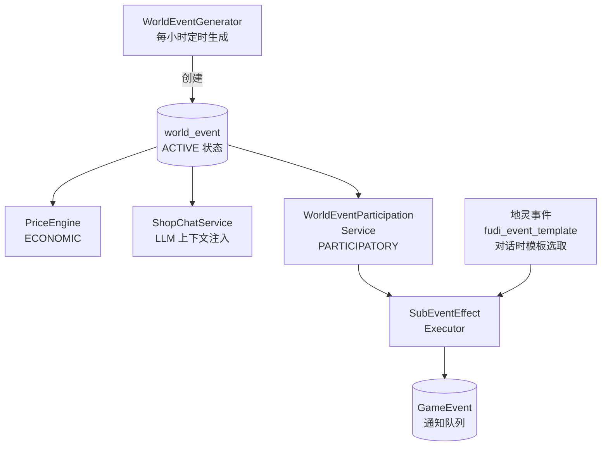

# 世界事件系统

## 1. 设计目标

覆盖**经济、环境、叙事、玩家参与**四大维度的全局事件系统。事件通过定时任务从预定义模板池加权选取自动生成，配合地灵事件的深度集成，为玩家提供动态变化的游戏世界。

## 2. 核心概念

### 2.1 事件类别

| 类别 | 说明 | 消费方 |
|------|------|--------|
| `ECONOMIC` | 影响物品价格 | PriceEngine、ShopChatService |
| `ENVIRONMENTAL` | 影响修炼/旅途/恢复 | TravelCompleter、TrainingCompleter（预留） |
| `NARRATIVE` | 纯叙事事件，注入 LLM 上下文 | SpiritChatService、ShopChatService |
| `PARTICIPATORY` | 玩家可主动参与获取奖励 | WorldEventParticipationService |

### 2.2 事件作用域

- **GLOBAL** — 所有玩家感知，全局生效
- **REGIONAL** — 绑定特定地图节点 (`region_map_node_id`)，仅在该区域生效

### 2.3 事件生命周期

```
UPCOMING → ACTIVE → ENDING → EXPIRED
  预告      进行中     收尾     过期
```

- 定时任务（30分钟）自动切换状态
- `start_time` 到达时 UPCOMING → ACTIVE
- `end_time` 到达时 ACTIVE → EXPIRED

## 3. 数据模型

### 3.1 世界事件表

```sql
CREATE TABLE world_event (
    id                    BIGSERIAL PRIMARY KEY,
    category              VARCHAR(32) NOT NULL
        CHECK (category IN ('ECONOMIC', 'ENVIRONMENTAL', 'NARRATIVE', 'PARTICIPATORY')),
    scope                 VARCHAR(16) NOT NULL DEFAULT 'GLOBAL'
        CHECK (scope IN ('GLOBAL', 'REGIONAL')),
    region_map_node_id    BIGINT,
    title                 VARCHAR(128) NOT NULL,
    description           TEXT NOT NULL,
    status                VARCHAR(16) NOT NULL DEFAULT 'ACTIVE'
        CHECK (status IN ('UPCOMING', 'ACTIVE', 'ENDING', 'EXPIRED')),
    start_time            TIMESTAMP NOT NULL,
    end_time              TIMESTAMP NOT NULL,
    affected_tags         JSONB,              -- ECONOMIC: 受影响的物品标签
    global_multiplier     NUMERIC(4,2) DEFAULT 1.00,
    effects               JSONB DEFAULT '[]',  -- 效果配置，同 SubEventEffect 格式
    participation_enabled BOOLEAN DEFAULT false,
    participation_limit   INT,                -- NULL=无限制, 0=无限制
    participation_count   INT DEFAULT 0,       -- 原子更新
    participation_effects JSONB,              -- 参与奖励效果
    parent_event_id       BIGINT,             -- 事件链：父事件
    chain_order           INT,                -- 事件链：顺序
    created_at            TIMESTAMP DEFAULT NOW(),
    created_by            VARCHAR(64) DEFAULT 'SYSTEM'
);
```

### 3.2 事件模板表

```sql
CREATE TABLE world_event_template (
    id                    BIGSERIAL PRIMARY KEY,
    category              VARCHAR(32) NOT NULL,
    scope                 VARCHAR(16) NOT NULL DEFAULT 'GLOBAL',
    title                 VARCHAR(128) NOT NULL,
    description           TEXT NOT NULL,
    cooldown_hours        INT NOT NULL DEFAULT 24,
    selection_weight      INT NOT NULL DEFAULT 100,
    duration_hours        INT NOT NULL DEFAULT 6,
    affected_tags         JSONB,
    global_multiplier     NUMERIC(4,2) DEFAULT 1.00,
    effects               JSONB DEFAULT '[]',
    participation_enabled BOOLEAN DEFAULT false,
    participation_limit   INT,
    participation_effects JSONB,
    valid_region_tags     JSONB,              -- 区域标签过滤
    chained_template_id   BIGINT,             -- 事件链：后继模板
    created_by            VARCHAR(64) DEFAULT 'SYSTEM',
    created_at            TIMESTAMP DEFAULT NOW()
);
```

## 4. 效果系统

世界事件效果**完全复用**异步事件系统的 `SubEventEffectExecutor` 管线，与 `xt_activity_event.params` 同格式。

### 支持的效果类型

| type | 参数 | 说明 |
|------|------|------|
| `ADD_EXP_PERCENT` | `percent` (1=N%) | 升级所需修为的百分比 |
| `ADD_SPIRIT_STONES` | `amount` | 灵石 |
| `HEAL_FLAT` | `amount` | 固定回血 |
| `TAKE_DAMAGE_PERCENT` | `percent` | 百分比扣血 |
| `TAKE_DAMAGE_FLAT` | `amount` | 固定扣血 |

### 效果格式

```json
// 简单效果
{"effects": [{"type": "ADD_EXP_PERCENT", "percent": 15}, {"type": "ADD_SPIRIT_STONES", "amount": 200}]}

// 分母分支 (60%/40%)
{"branches": [
  {"chance": 0.6, "effects": [{"type": "ADD_EXP_PERCENT", "percent": 15}, {"type": "ADD_SPIRIT_STONES", "amount": 200}]},
  {"chance": 0.4, "effects": [{"type": "ADD_EXP_PERCENT", "percent": 5}, {"type": "ADD_SPIRIT_STONES", "amount": 80}]}
]}
```

## 5. 事件生成

### 5.1 定时生成

`WorldEventGenerator.scheduledGeneration()` 每小时触发一次：
1. 统计当前活跃事件数
2. 若 < 2 则触发生成
3. 从模板池加权随机选取模板
4. 限制：每个类别不超过活跃事件的 1/3，区域事件 ≤ 2
5. 从模板创建事件实例写入 DB
6. 若模板配置了 `chained_template_id`，同时创建子事件（UPCOMING 状态），`parent_event_id` 指向父事件

### 5.2 事件链激活

`WorldEventService.refreshActiveStatus()` 每 30 分钟执行：
1. 过期事件标记为 EXPIRED
2. 检查所有 UPCOMING 事件：其 `parent_event_id` 指向的事件已过期 → 激活为 ACTIVE
3. UPCOMING 事件的 `start_time` 到达 → 激活为 ACTIVE

### 5.2 加权随机选取

```java
int totalWeight = Σ template.selectionWeight;
int roll = random(totalWeight);
// 按累积权重落在哪个模板区间
```

### 5.3 种子模板（40 条）

| 类别 | 数量 | 示例 |
|------|------|------|
| ECONOMIC | 10 | 灵石矿脉发现、丹会大比、商队抵达、天灾降临 |
| ENVIRONMENTAL | 10 | 灵气潮汐、道韵弥漫、暴风雪、灵泉涌现 |
| NARRATIVE | 10 | 天降异象、仙人过境、古遗迹现世、万妖朝拜 |
| PARTICIPATORY | 10 | 悬赏缉凶、秘境探索、猎杀妖兽、收服灵兽 |

### 5.4 环境事件生效机制

ENVIRONMENTAL 事件在旅行到达和历练结算时自动触发：

- **旅行到达**：`TravelCompleter.completeTravel()` → 查询到达地图的 REGIONAL ENVIRONMENTAL 事件 + GLOBAL ENVIRONMENTAL 事件 → 应用效果 → 创建 GameEvent 通知
- **历练结算**：`TrainingCompleter.applyEnvironmentalEvents()` → 查询当前地图的 REGIONAL + GLOBAL ENVIRONMENTAL 事件 → 应用效果 → 创建 GameEvent 通知

效果通过 `SubEventEffectExecutor` 执行，支持 ADD_EXP_PERCENT（正负均可）、HEAL_FLAT、TAKE_DAMAGE_PERCENT/FLAT 等类型。

## 6. 玩家参与

### 6.1 参与流程

```
玩家输入"参与事件 <编号>"
  → WorldEventListener 解析参数
  → WorldEventCommandHandler.handleJoinEvent()
  → WorldEventParticipationService.participate()
     → 校验事件存在 + 活跃 + 类别为 PARTICIPATORY
     → 原子检查参与人数 (UPDATE ... WHERE participation_count < participation_limit)
     → 执行 participation_effects（含分支随机）
     → 创建 GameEvent 通知
  → 返回结果文本
```

### 6.2 并发安全

```sql
UPDATE world_event
SET participation_count = participation_count + 1
WHERE id = #{id}
  AND (participation_limit IS NULL OR participation_count < participation_limit);
```

单条 SQL 保证原子性，`updated == 0` 表示名额已满。

### 6.3 参与事件奖励校准

所有修为奖励使用百分比 (`ADD_EXP_PERCENT`)，自动适配玩家等级。

| 事件 | 修为% | 灵石 | 名额 | 风险 |
|------|-------|------|------|------|
| 护送任务 | 8% | 80 | 不限 | — |
| 布阵护山 | 10% | 100 | 150 | — |
| 悬赏缉凶 | 15% | 200 | 80 | — |
| 炼丹比试 | 20% | 300 | 80 | — |
| 猎杀妖兽 | 25% | 200 | 60 | — |
| 救助道侣 | 15% | — | 不限 | +恢复 500HP |
| 寻找灵药 | 20% | 400 | 30 | — |
| 探查遗迹 | 35% | 500 | 50 | 30% 扣 20%HP |
| 秘境探索 | 40% | 800 | 80 | — |
| 收服灵兽 | 50% | 1000 | 30 | — |

> 校准基准：悬赏副事件 EXP 范围 80~10,000，灵石 30~5,000。世界事件定位为介于低端和中端悬赏奖励之间，无消耗即可参与。

## 7. 地灵事件深度集成

### 7.1 设计原则

地灵事件保持独立的触发机制（对话触发、时间门控），基于 `fudi_event_template` 模板池随机选取，并接入 SubEventEffect 效果管线。

### 7.2 有效果的地灵事件

| 事件名称 | 效果 | 设计意图 |
|----------|------|----------|
| 下雨了 | ADD_EXP_PERCENT 5% | 灵雨助修炼 |
| 灵蝶飞舞 | ADD_SPIRIT_STONES × 3 | 灵蝶的小礼物 |
| 神秘访客 | ADD_RANDOM_ITEM (MATERIAL_COMMON) | 访客留下谢礼 |
| 灵兽诞生 | ADD_EXP_PERCENT 8% | 新生命带来灵气 |
| 灵气恢复 | HEAL_FLAT × 30 | 灵气自然恢复 |

其余 7 个事件保持纯叙事无效果。

### 7.3 执行流程

```
SpiritChatService.chatWithSpirit()
  → FudiEventGenerator.generateEvents()
  → LLM 对话（注入事件叙述）
  → applyFudiEventEffects()        ← 新增
     → 收集有效果的事件
     → SubEventEffectExecutor.executeEffects()
     → 创建 GameEvent(WORLD_EVENT) 进入通知队列
  → 更新 spirit.lastEventTime
```

## 8. 通知系统

### 8.1 GameEvent 类别

- `WORLD_EVENT` — 地灵事件效果通知
- `WORLD_EVENT_PARTICIPATION` — 玩家参与事件结果通知

两者均通过现有的 `NotificationAppender` 拦截回复并追加到尾部。

### 8.2 WorldEventNotifier

为指定用户批量创建世界事件相关 GameEvent，供未来扩展（如：事件开始时向在线玩家推送通知）。

## 9. 与现有系统的关系



## 10. 设计决策记录

| 决策 | 选择 | 理由 |
|------|------|------|
| 事件生成方式 | 模板加权随机 | 不依赖 AI API 稳定性，可预测可平衡 |
| 效果系统 | 复用 SubEventEffectExecutor | 零新代码，12 种效果直接可用 |
| 修为奖励 | 百分比而非固定值 | 低等级不高、高等级不废，O(n²) 曲线自然适配 |
| 地灵事件 | 独立触发 + 共享效果管线 | 叙事独立性保留，机制能力增强 |
| 参与并发控制 | UPDATE WHERE 单 SQL | 无锁竞争，原子性保证 |
| 事件类别粒度 | 4 个互斥类别 | 每个类别消费方不同，职责清晰 |
| 区域事件隔离 | scope + region_map_node_id | GLOBAL 事件全量可见，REGIONAL 事件仅当地可见 |
| 事件链预留 | parent_event_id + chain_order + chained_template_id | 模板可指定链式后继，事件过期时自动激活子链事件 |
| 环境事件接入 | TravelCompleter/TrainingCompleter 结算时查询 | 玩家到达/结算时感知当地 ENVIRONMENTAL 事件效果 |
