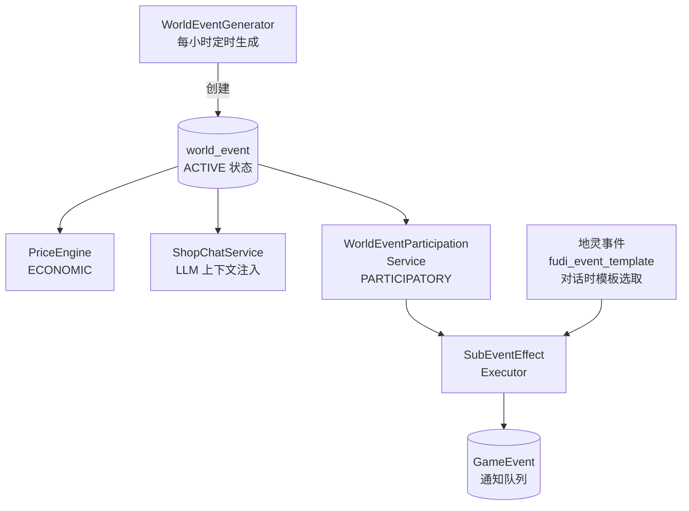

# 世界事件系统 详细设计

行为契约见同目录 spec.md；本文档为详细设计参考。

## 1. 设计目标

覆盖**经济、环境、叙事、玩家参与**四大维度的全局事件系统。事件通过定时任务从预定义模板池加权选取自动生成，配合地灵事件的深度集成，为玩家提供动态变化的游戏世界。

## 2. 核心概念

### 2.1 事件类别

| 类别 | 说明 | 消费方（代码现状） |
|------|------|--------------------|
| `ECONOMIC` | 影响物品价格 | `PriceEngine`（商铺价格乘数）、`ShopChatService`（对话上下文） |
| `ENVIRONMENTAL` | 影响修炼/旅途/恢复 | `TravelCompleter`、`TrainingCompleter`（结算时应用效果） |
| `NARRATIVE` | 纯叙事事件，注入 LLM 上下文 | `ShopChatService`（掌柜对话上下文；`SpiritChatService` 未接入） |
| `PARTICIPATORY` | 玩家可主动参与获取奖励 | `WorldEventParticipationService` |

枚举 `WorldEventCategory` 的 code 与 DB CHECK 完全一致（`ECONOMIC` / `ENVIRONMENTAL` / `NARRATIVE` / `PARTICIPATORY`），未知 code 抛 `IllegalArgumentException`。

### 2.2 事件作用域

- **GLOBAL** — 所有玩家感知，全局生效
- **REGIONAL** — 绑定特定地图节点（`region_map_node_id`），仅在该区域生效

枚举 `WorldEventScope`：`GLOBAL` / `REGIONAL`。注意：当前生成器不会写入 `region_map_node_id`（见「迁移评估」B/D 段），区域事件实际只表现为列表中的「区域」标记。

### 2.3 事件生命周期

```
UPCOMING → ACTIVE → ENDING → EXPIRED
  预告      进行中     收尾     过期
```

枚举 `WorldEventStatus`：`UPCOMING`（预告）/ `ACTIVE`（进行中）/ `ENDING`（收尾）/ `EXPIRED`（已过期）。代码只写入 `UPCOMING`、`ACTIVE`、`EXPIRED` 三种；`ENDING` 保留在枚举与 DB CHECK 中但从未被赋值。

- 定时任务（每 30 分钟）自动切换状态
- `start_time` 到达时 UPCOMING → ACTIVE
- `end_time` 到达时 ACTIVE → EXPIRED

## 3. 数据模型

### 3.1 世界事件表（`world_event`，迁移 V1.0.29）

```sql
CREATE TABLE world_event (
    id                    BIGSERIAL PRIMARY KEY,
    category              VARCHAR(32) NOT NULL
        CHECK (category IN ('ECONOMIC', 'ENVIRONMENTAL', 'NARRATIVE', 'PARTICIPATORY')),
    scope                 VARCHAR(16) NOT NULL DEFAULT 'GLOBAL'
        CHECK (scope IN ('GLOBAL', 'REGIONAL')),
    region_map_node_id    BIGINT,               -- FK → map_node(id) ON DELETE SET NULL
    title                 VARCHAR(128) NOT NULL,
    description           TEXT NOT NULL,
    status                VARCHAR(16) NOT NULL DEFAULT 'ACTIVE'
        CHECK (status IN ('UPCOMING', 'ACTIVE', 'ENDING', 'EXPIRED')),
    start_time            TIMESTAMP NOT NULL,
    end_time              TIMESTAMP NOT NULL,
    affected_tags         JSONB,                -- ECONOMIC: 受影响的物品标签
    global_multiplier     NUMERIC(4,2) NOT NULL DEFAULT 1.00,
    effects               JSONB NOT NULL DEFAULT '[]',   -- 效果配置（EffectEntry 列表）
    participation_enabled BOOLEAN NOT NULL DEFAULT FALSE,
    participation_limit   INT,                  -- NULL=无限制, 0=无限制
    participation_count   INT NOT NULL DEFAULT 0,        -- 原子更新，CHECK >= 0
    participation_effects JSONB,                -- 参与奖励效果
    parent_event_id       BIGINT,               -- 事件链：父事件（FK → world_event(id) ON DELETE SET NULL）
    chain_order           INT,                  -- 事件链：顺序（NULL 或 > 0）
    created_at            TIMESTAMP NOT NULL DEFAULT NOW(),
    created_by            VARCHAR(64) DEFAULT 'SYSTEM'
);
```

索引：

- `idx_world_event_active (start_time, end_time) WHERE status = 'ACTIVE'`
- `idx_world_event_region (scope, region_map_node_id) WHERE scope = 'REGIONAL'`
- `idx_world_event_chain (parent_event_id) WHERE parent_event_id IS NOT NULL`
- `idx_world_event_category (category)`
- `idx_world_event_upcoming (start_time) WHERE status = 'UPCOMING'`

实体行为（`WorldEvent`）：

- `isActive()` — `status == ACTIVE` 且 `now ∈ [start_time, end_time]`
- `isRegional()` / `isGlobal()` — 作用域判断
- `getGlobalMultiplierDouble()` — 空值回退 1.0
- `affectsAnyTag(tags)` — 受影响标签与给定标签有交集
- `hasEffects()` — `effects` 非空
- `canParticipate()` — `participation_enabled == TRUE` 且（`participation_limit` 为空或 0 或 `participation_count < participation_limit`）

### 3.2 事件模板表（`world_event_template`，迁移 V1.0.48）

```sql
CREATE TABLE world_event_template (
    id                    BIGSERIAL PRIMARY KEY,
    category              VARCHAR(32) NOT NULL
        CHECK (category IN ('ECONOMIC', 'ENVIRONMENTAL', 'NARRATIVE', 'PARTICIPATORY')),
    scope                 VARCHAR(16) NOT NULL DEFAULT 'GLOBAL'
        CHECK (scope IN ('GLOBAL', 'REGIONAL')),
    title                 VARCHAR(128) NOT NULL,
    description           TEXT NOT NULL,
    cooldown_hours        INT NOT NULL DEFAULT 24,
    selection_weight      INT NOT NULL DEFAULT 100,
    duration_hours        INT NOT NULL DEFAULT 6,
    affected_tags         JSONB,
    global_multiplier     NUMERIC(4,2) DEFAULT 1.00,
    effects               JSONB NOT NULL DEFAULT '[]',
    participation_enabled BOOLEAN NOT NULL DEFAULT FALSE,
    participation_limit   INT,
    participation_effects JSONB,
    valid_region_tags     JSONB,              -- 区域标签过滤（当前未使用）
    chained_template_id   BIGINT REFERENCES world_event_template(id),
    created_by            VARCHAR(64) DEFAULT 'SYSTEM',
    created_at            TIMESTAMP NOT NULL DEFAULT NOW()
);
```

索引：`idx_world_event_template_category (category)`、`idx_world_event_template_chain (chained_template_id)`。

实体行为（`WorldEventTemplate`）：`getGlobalMultiplierDouble()` 空值回退 1.0；`getCooldownHours()` 空值回退 24；`getDurationHours()` 空值回退 6；`getSelectionWeightInt()` 空值回退 100。

## 4. 效果系统

世界事件效果**复用**异步事件系统的 `SubEventEffectExecutor` 管线，与 `xt_activity_event.params` 同格式。

### 4.1 效果类型

`SubEventEffectType` 共 13 种：`ADD_EXP`、`ADD_EXP_PERCENT`、`TAKE_DAMAGE_PERCENT`、`TAKE_DAMAGE_FLAT`、`HEAL_FLAT`、`ADD_ITEM`、`ADD_RANDOM_ITEM`、`CREATE_EQUIPMENT`、`DROP_SPECIALTY`、`ADD_SPIRIT_STONES`、`TAKE_SPIRIT_STONES`、`MULTIPLY_BOUNTY_REWARD`、`PURE_NARRATIVE`。世界事件实际配置中使用的类型：

| type | 参数 | 说明 |
|------|------|------|
| `ADD_EXP_PERCENT` | `percent` (1=N%) | 升级所需修为的百分比 |
| `ADD_SPIRIT_STONES` | `amount` | 灵石 |
| `HEAL_FLAT` | `amount` | 固定回血 |
| `TAKE_DAMAGE_PERCENT` | `percent` | 百分比扣血（受参数键解析问题影响，实际不生效，见差异清单） |
| `TAKE_DAMAGE_FLAT` | `amount` | 固定扣血 |

### 4.2 效果格式

```json
// 简单效果（world_event.effects 与 participation_effects 均支持）
{"effects": [{"type": "ADD_EXP_PERCENT", "percent": 15}, {"type": "ADD_SPIRIT_STONES", "amount": 200}]}

// 分母分支 (60%/40%)（仅 participation_effects 的原始 JSON 配置支持）
{"branches": [
  {"chance": 0.6, "effects": [{"type": "ADD_EXP_PERCENT", "percent": 15}, {"type": "ADD_SPIRIT_STONES", "amount": 200}]},
  {"chance": 0.4, "effects": [{"type": "ADD_EXP_PERCENT", "percent": 5}, {"type": "ADD_SPIRIT_STONES", "amount": 80}]}
]}
```

### 4.3 两条执行路径

- **事件自身效果**（`world_event.effects`）：JSONB 反序列化为 `List<EffectEntry>`（类型安全记录，`type` + 参数），`WorldEventEffectApplier.applyEffects(event, user)` 将每个条目转回 `Map` 后交给 `SubEventEffectExecutor.executeEffects`。**不支持 branches**。
- **参与奖励**（`world_event.participation_effects`）：保留为 `List<Map<String, Object>>` 原始配置，`WorldEventEffectApplier.applyEffectsFromConfig` 逐项判断：含 `branches` 键走 `BranchResolver.resolve`（按 `chance` 累积概率抽一支），否则取 `effects` 列表（单项直接含 `type` 时作为单条效果）。
- 两条路径均以 `EventContext.empty()` 执行；异常时记录日志并返回空结果（不中断命令）。

## 5. 事件生成

### 5.1 定时生成（`WorldEventGenerator.scheduledGeneration()`）

`@Scheduled(fixedRate = 3600000)` 每小时触发：

1. 统计当前活跃事件数（`status='ACTIVE'` 且当前时间在 `[start_time, end_time]` 内）
2. 若 < `MIN_ACTIVE_EVENTS`（2）则执行 `generateNewEvents()`
3. 目标活跃上限 `MAX_ACTIVE_EVENTS = 6`：`needed = 6 - 当前活跃数`，单轮最多生成 `min(needed, 3)` 个
4. 类别限制：活跃数 ≤ 3 时不限制；否则每类别不超过 `max(2, 活跃数 / 3)`（达到即从候选池剔除）
5. 区域事件上限 `MAX_REGIONAL_EVENTS = 2`；选到区域模板但已达上限时，回退到全局模板池重新加权选取
6. 从候选模板池加权随机选取模板，从模板创建事件实例写入 DB（`created_by = 'SYSTEM'`）
7. 若模板配置了 `chained_template_id`，同时创建子事件（UPCOMING 状态），`parent_event_id` 指向父事件，`chain_order = 2`

模板 → 事件字段映射（`buildEvent`）：`category`、`scope`、`title`、`description`、`affected_tags`、`global_multiplier`、`effects`、`participation_enabled`、`participation_limit`、`participation_effects`；`start_time = now`、`end_time = now + duration_hours`、`participation_count = 0`。`cooldown_hours`、`valid_region_tags` 不参与生成（见差异清单）。

### 5.2 加权随机选取

```java
int totalWeight = Σ template.selectionWeight;   // 空值回退 100
int roll = random(totalWeight);                 // ThreadLocalRandom
// 按累积权重落在哪个模板区间；总权重 ≤ 0 时退化为均匀随机
```

### 5.3 事件链激活

`WorldEventService.refreshActiveStatus()` 每 30 分钟执行：

1. 过期事件（`end_time` 早于当前时间）标记为 EXPIRED，并触发 `activateChainedChildren`
2. 检查所有 UPCOMING 事件：其 `parent_event_id` 指向的事件已过期 → 立即激活为 ACTIVE，`start_time = now`，`end_time = now + 原计划时长`（由子事件原 `start_time`/`end_time` 差值得到，异常时回退 6 小时）
3. UPCOMING 事件的 `start_time` 到达 → 激活为 ACTIVE

### 5.4 种子模板（40 条，迁移 V1.0.48.1）

| 类别 | 数量 | 示例 |
|------|------|------|
| ECONOMIC | 10 | 灵石矿脉发现、丹会大比、商队抵达、天灾降临 |
| ENVIRONMENTAL | 10 | 灵气潮汐、道韵弥漫、暴风雪、灵泉涌现 |
| NARRATIVE | 10 | 天降异象、仙人过境、古遗迹现世、万妖朝拜 |
| PARTICIPATORY | 10 | 悬赏缉凶、秘境探索、猎杀妖兽、收服灵兽 |

### 5.5 环境事件生效机制

ENVIRONMENTAL 事件在旅行到达和历练结算时自动触发：

- **旅行到达**：`TravelCompleter.completeTravel()` 在到达叙事、子事件、隐藏事件之后调用 `WorldEventEnvironmentalApplier.apply()`
- **历练结算**：`TrainingCompleter.applyEnvironmentalEvents()`（由 `TrainingService` 在正常结算时调用；濒死中断不调用）→ 同一 Applier
- Applier 规则（代码实际）：查询到达/当前地图的**区域** ENVIRONMENTAL 事件；**只要区域列表非空就只应用区域事件，全局事件被跳过**；区域列表为空时才应用全局 ENVIRONMENTAL 事件
- 仅对 `hasEffects()` 为真的事件执行；效果结果为空则不产生通知
- 效果通过 `SubEventEffectExecutor` 执行，支持 `ADD_EXP_PERCENT`（正负均可）、`HEAL_FLAT`、`TAKE_DAMAGE_PERCENT/FLAT` 等类型（类型可用性见 4.1）
- 应用成功创建 `GameEventCategory.WORLD_EVENT` 通知，叙事为「事件标题：事件描述」+ 效果参数

## 6. 玩家参与

### 6.1 参与流程

```
玩家输入"参与事件 <编号>"
  → WorldEventListener（模板 参与事件\s*{{eventId,\d+}}，要求认证）
  → WorldEventCommandHandler.handleJoinEvent()
  → WorldEventParticipationService.participate()
     → 校验事件存在（否则「世界事件不存在」）
     → 校验活跃（否则「该世界事件已过期」）
     → 校验类别为 PARTICIPATORY（否则「该事件不支持玩家参与」）
     → 校验 canParticipate（否则「该事件参与人数已满」）
     → 原子占用名额 (UPDATE ... WHERE participation_count < participation_limit)
        updated == 0 → 「该事件参与人数已满」
     → 执行 participation_effects（含分支随机）
     → 创建 GameEvent(WORLD_EVENT_PARTICIPATION) 通知
  → 返回结果文本「你参与了【标题】！」+ 奖励摘要
```

校验顺序固定为：存在 → 活跃 → 类别 → 名额 → 原子更新。注意 `participation_enabled=false` 的参与类事件同样会得到「参与人数已满」提示；UPCOMING 事件参与时报「已过期」。

### 6.2 并发安全

```sql
UPDATE world_event
SET participation_count = participation_count + 1
WHERE id = #{id}
  AND (participation_limit IS NULL OR participation_count < participation_limit);
```

单条 SQL 保证原子性，`updated == 0` 表示名额已满。

### 6.3 参与奖励校准

所有修为奖励使用百分比 (`ADD_EXP_PERCENT`)，自动适配玩家等级。种子模板实际配置（含分支概率）：

| 事件 | 修为% | 灵石 | 名额 | 分支/风险 |
|------|-------|------|------|-----------|
| 护送任务 | 8% | 80 | 不限 | — |
| 布阵护山 | 10% | 100 | 150 | — |
| 悬赏缉凶 | 15% / 5% | 200 / 80 | 80 | 60% 高档 / 40% 低档 |
| 炼丹比试 | 20% | 300 | 80 | — |
| 猎杀妖兽 | 25% | 200 | 60 | — |
| 救助道侣 | 15% | — | 不限 | 固定恢复 500 HP |
| 寻找灵药 | 20% / 8% | 400 / 150 | 30 | 50% / 50% |
| 探查遗迹 | 35% / 10% / 3% | 500 / 150 / — | 50 | 40% / 30% / 30%（末档附带 20% 扣血） |
| 秘境探索 | 40% / 15% / — | 800 / 300 / 200 | 80 | 30% / 40% / 30% |
| 收服灵兽 | 50% / 12% | 1000 / 150 | 30 | 30% / 70% |

> 校准基准：悬赏副事件 EXP 范围 80~10,000，灵石 30~5,000。世界事件定位为介于低端和中端悬赏奖励之间，无消耗即可参与。

### 6.4 参与结果文案

`WorldEventParticipationService.buildEffectDescription()` 对效果执行结果做键名归一化（小写、去下划线）后展示：

- 含 `exp` → 「获得修为 +N」
- 含 `spirit` 且含 `stone` → 「获得灵石 +N」
- 含 `heal` 或 `hp` → 「气血 +N」
- 含 `count` → 物品数量暂存
- 字符串键含 `item`/`herb` → 物品名；数量 >1 时输出「获得物品：名称 xN」
- `damage` 等内部数值键不展示

## 7. 地灵事件深度集成（设计参考，未实现）

> 本节为原设计文档保留的设计参考。代码中不存在 `fudi_event_template`、`FudiEventGenerator`、`applyFudiEventEffects()`，`SpiritChatService` 未接入世界事件效果管线。

### 7.1 设计原则

地灵事件保持独立的触发机制（对话触发、时间门控），基于 `fudi_event_template` 模板池随机选取，并接入 SubEventEffect 效果管线。

### 7.2 有效果的地灵事件

| 事件名称 | 效果 | 设计意图 |
|----------|------|----------|
| 下雨了 | ADD_EXP_PERCENT 5% | 灵雨助修炼 |
| 灵蝶飞舞 | ADD_SPIRIT_STONES × 3 | 灵蝶的小礼物 |
| 神秘访客 | ADD_RANDOM_ITEM (MATERIAL_COMMON) | 访客留下谢礼 |
| 灵兽诞生 | ADD_EXP_PERCENT 8% | 新生命带来灵气 |
| 灵气恢复 | HEAL_FLAT × 30 | 灵气自然恢复 |

其余 7 个事件保持纯叙事无效果。

### 7.3 执行流程（设计）

```
SpiritChatService.chatWithSpirit()
  → FudiEventGenerator.generateEvents()
  → LLM 对话（注入事件叙述）
  → applyFudiEventEffects()
     → 收集有效果的事件
     → SubEventEffectExecutor.executeEffects()
     → 创建 GameEvent(WORLD_EVENT) 进入通知队列
  → 更新 spirit.lastEventTime
```

## 8. 通知系统

### 8.1 GameEvent 类别

- `WORLD_EVENT` — 环境世界事件效果通知
- `WORLD_EVENT_PARTICIPATION` — 玩家参与事件结果通知

两者均通过现有通知机制在后续回复中追加投递。

### 8.2 WorldEventNotifier（设计参考，未实现）

原设计：为指定用户批量创建世界事件相关 GameEvent，供未来扩展（如：事件开始时向在线玩家推送通知）。代码中不存在该类，通知由 `GameEventService` 直接创建。

## 9. 与现有系统的关系



> 图中「地灵事件」链路为设计参考，未实现（见第 7 节）。

## 10. 设计决策记录

| 决策 | 选择 | 理由 |
|------|------|------|
| 事件生成方式 | 模板加权随机 | 不依赖 AI API 稳定性，可预测可平衡 |
| 效果系统 | 复用 SubEventEffectExecutor | 零新代码，13 种效果直接可用 |
| 修为奖励 | 百分比而非固定值 | 低等级不高、高等级不废，O(n²) 曲线自然适配 |
| 地灵事件 | 独立触发 + 共享效果管线 | 叙事独立性保留，机制能力增强（设计参考，未实现） |
| 参与并发控制 | UPDATE WHERE 单 SQL | 无锁竞争，原子性保证 |
| 事件类别粒度 | 4 个互斥类别 | 每个类别消费方不同，职责清晰 |
| 区域事件隔离 | scope + region_map_node_id | GLOBAL 事件全量可见，REGIONAL 事件仅当地可见（绑定尚未接线） |
| 事件链预留 | parent_event_id + chain_order + chained_template_id | 模板可指定链式后继，事件过期时自动激活子链事件 |
| 环境事件接入 | TravelCompleter/TrainingCompleter 结算时查询 | 玩家到达/结算时感知当地 ENVIRONMENTAL 事件效果 |

## 迁移评估：设计取舍

> 原设计文档与实现的差异评估。A 实现现状（文档已按代码修正）；B 保留代码设计（更合乎玩法）；C 按设计修正（设计意图更优，条目标注已修/待修）；D 未实现（待办）；E 缺陷修复。

### A. 实现现状（文档已修正）

- **`ENDING` 状态未赋值**：枚举与 DB CHECK 保留，代码只写 `UPCOMING` / `ACTIVE` / `EXPIRED`；无「收尾」阶段的消费方。
- **参与类事件提示口径**：`participation_enabled=false` 报「该事件参与人数已满」、`UPCOMING` 报「该世界事件已过期」；列表只展示进行中事件，误报路径基本不可达，spec 已按此契约化。
- **参与奖励表**：已按种子数据的分支概率展开（如悬赏缉凶 60% 得 15%/200、40% 得 5%/80）。
- **DDL 细节**：`world_event` 的 `global_multiplier`、`effects`、`participation_enabled`、`participation_count`、`created_at` 为 NOT NULL，并有参与计数与链序 CHECK；以 V1.0.29 / V1.0.48 为准。
- **`WorldEventVO` 未被使用**：VO 已定义但无调用方（列表展示自行格式化），仅供未来展示层使用。

### B. 保留代码设计

- **环境事件区域优先**：存在区域环境事件时跳过全局，避免多事件效果叠加放大、以及「远处的全局事件压过本地氛围」；与区域隔离设计一致，spec 已契约化。
- **生成补充的多重上限**：目标 6、单轮最多 3、类别上限 `max(2, 活跃数/3)`、区域上限 2——防止事件刷屏与单类别垄断，维持世界感多样。
- **`WorldEventNotifier` 不实现**：产品决定永不使用 QQ 主动消息，事件通知只随玩家回复投递；该类不应按原设计补做。

### C. 按设计修正（待修）

无。

### D. 未实现（待办）

- **地灵事件集成**：设计意图 = `fudi_event_template` 模板池 + 对话触发 + `applyFudiEventEffects` 接入 SubEventEffect 管线；现状 = 表与相关类均不存在，`SpiritChatService` 未接入（见 `spirit-chat` 的福地事件系统）。

> 已实现（本轮）：REGIONAL 事件按 `valid_region_tags` 匹配地图并写 `region_map_node_id`；环境效果与「世界事件」列表按玩家所在地过滤（全局 + 当地）；NARRATIVE 事件注入地灵对话。

### E. 缺陷修复

- **模板冷却 `cooldown_hours` 无效**（已修）：生成器按「标题（模板近似标识）+ created_at」过滤冷却期内模板；`world_event` 无来源模板列，后续应改按模板 ID 匹配。
- **`TAKE_DAMAGE_PERCENT` 实际不生效**（已修）：参数读取兼容 `percent`/`amount`，伤害语义 = 最大生命 × 归一化倍率，负值 clamp 到 0。
- **`ADD_EXP_PERCENT` 单位不一致导致奖励放大 100 倍**（已修）：`PercentParams.resolveMultiplier` 统一口径（>1 视为整数百分数 ÷100，≤1 视为小数倍率），`Player.addExp` 增加下限保护；活动事件种子（0.02~0.08）不受影响。
